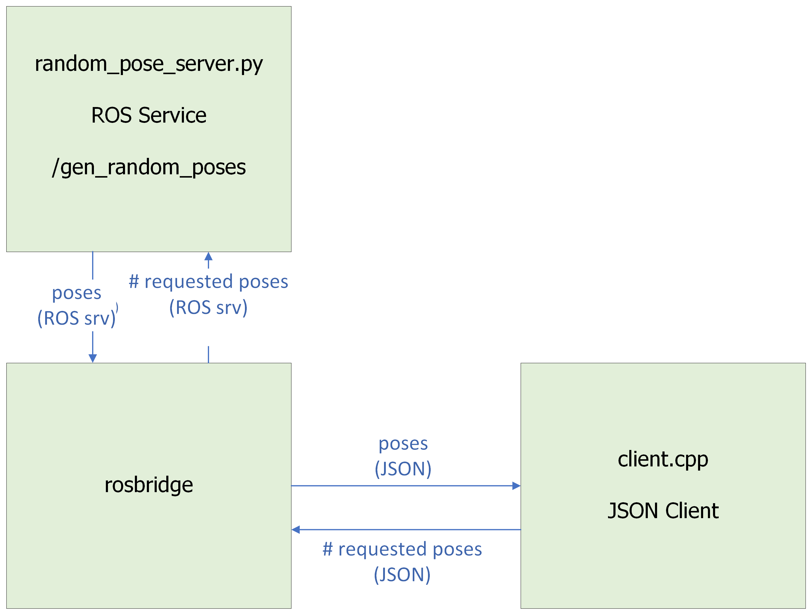

# rosbridge_demo
A demonstration of basic rosbridge functionality in a ROS system.

As shown in the diagram, rosbridge exposes a JSON interface to a ROS service.
Specifically, the service `/gen_random_poses` generates a requested number of 6DOF poses. A simple client node, written in C++, requests poses through the JSON API.

rosbridge automatically provides a websocket JSON API through the ROSBridge Protocol, with a schema like
```JSON
{ 
  "op": "call_service", 
  "service": "/gen_random_pose", 
  "args": [2]
}
```
that is [well-documented](https://github.com/RobotWebTools/rosbridge_suite/blob/ros1/ROSBRIDGE_PROTOCOL.md). Because it is documented, actively maintained, and automically configured, it is a potentially scalable choice for ROS JSON API needs. 



---
# Installation and Usage

## Docker (Recommended)
This demo can be run in Docker containers, which greatly simplifies installation. Docker is supported on Windows, Mac, and many flavors of Linux including Windows Subsystem for Linux. I uploaded images on Docker Hub that you can download with the following commands.
1. Install Docker Engine by following the official [instructions](https://docs.docker.com/engine/install/).
2. Download and run the `rosbridge_demo_ros` container. This container:
    * provides a ROS service that generates a list of random poses
    * starts a rosbridge server

    ```
    docker run -it --net=host playertr/rosbridge_demo_ros roslaunch ros_pose_gen pose_server.launch
    ```
3. Download and run the `rosbridge_demo_cpp` container. This container:
    * connects to the rosbridge websocket
    * requests two (from argument) random poses and prints the response
    ```
    docker run -it --net=host playertr/rosbridge_demo_cpp build/client 2
    ```

## Source
If you aren't using Docker, then you can still install all the dependencies locally in an Ubuntu machine. Here's a sketch of how to do that. For more detail, refer to the Docker installation scripts in `docker/Dockerfile_ros` and `docker/Dockerfile_cpp` and to the referenced instructions.
1. Install ROS (Melodic, which requires Ubuntu 18.04, has been tested) by following the [official instructions](http://wiki.ros.org/melodic/Installation/Ubuntu).
2. Install the `ros_pose_gen` package in a catkin workspace. This package provides a ROS service that generates a list of random poses.
3. Install rosbridge by following the [official instructions](http://wiki.ros.org/rosbridge_suite).
4. Install Microsoft's C++ REST SDK by following the official instructions in its Github [README](https://github.com/microsoft/cpprestsdk).
4. Install C++ build tools:
    ```
    sudo apt-get update
    sudo apt-get install build-essential cmake
    ```
5. Build the C++ client executable. This executable, which is installed to `cpp_client/build/main`, connects to a rosbridge server at `0.0.0.0:9090` and issues a service call to the ROS service.
    ```
    mkdir -p cpp_client/build
    cd cpp_client/build
    cmake ..
    make
    ```
6. Run the demo:
    * Terminal one:
        ```
        source devel/setup.bash
        roslaunch ros_pose_gen pose_server.launch
        ```
    * Terminal two:
        ```
        ./cpp_client/build/client
        ```

---
## Applicable Documentation

Service/Message definitions http://wiki.ros.org/ROS/Tutorials/CreatingMsgAndSrv 

ROS Service Tutorial http://wiki.ros.org/ROS/Tutorials/WritingServiceClient%28python%29

How to create a ROS package http://wiki.ros.org/ROS/Tutorials/CreatingPackage

rosbridge docs http://wiki.ros.org/rosbridge_suite

variable-length ROS messages http://wiki.ros.org/msg

ROS pose message http://docs.ros.org/en/noetic/api/geometry_msgs/html/msg/Pose.html

ROS msg capitalization conventions http://wiki.ros.org/ROS/Patterns/Conventions

Running rosbridge tutorial http://wiki.ros.org/rosbridge_suite/Tutorials/RunningRosbridge

rosbridge Protocol Specification https://github.com/RobotWebTools/rosbridge_suite/blob/ros1/ROSBRIDGE_PROTOCOL.md

Microsoft C++ REST SDK https://stackoverflow.com/questions/34423092/websocket-library
https://github.com/Microsoft/cpprestsdk


---
## Building the docker images
```
cd cpp_client
docker build . -f docker/Dockerfile_ros -t playertr/rosbridge_demo_ros
docker build . -f docker/Dockerfile_cpp -t playertr/rosbridge_demo_cpp
```